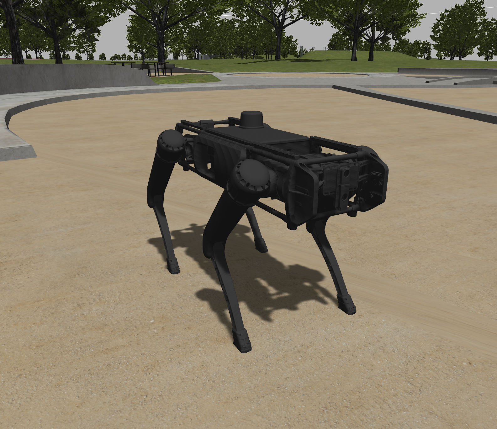

# Ghost Description

All of the URDFs, STLs and other robot description files.

This includes files for the Vision 60 V3, V4 and the Spirit 40.

The meshes for these products are located in the `meshes` directory under different
folders. A decimated version of all meshes are included for applications that don't need the
highest resolution.
 
The URDFs are organized in such a way that both the Vision 60 V3, V4, and both models in
simulation, all use the same files. The flag situation in these URDFs is therefore somewhat
extensive, but that's the chosen battle over instead having to manage 4 different versions of
the same robot's description.

The critical flags at the top of `./urdf/vision60.urdf.xacro` are shown here.

```xml
<xacro:arg name="use_gazebo" default="false"/> <!-- Include Sim related stuff or not -->
<xacro:arg name="v4" default="true"/>  <!-- 0=v3, 1=v4, selects meshes if enabled -->
<xacro:arg name="decimated" default="false"/> <!-- if meshes enabled, 1=decimated, 0=high res -->
<xacro:arg name="box_viz" default="false"/> <!-- 1=stylish boxes, 0=appropriate meshes -->
```

There are a number of files in the `./urdf/V3` directory that are not used with the base
`vision60.urdf.xacro` system; those are simple kept to maintain backwards compatibility with
older robots. Moving forward with the Vision 60 V4, all changes will be reflected in this one
master system with the subsequent macros being updated.

Ghost Robotics customers with SDK access will be able to access more documentation [here](https://ghostrobotics.gitlab.io/docs/)

